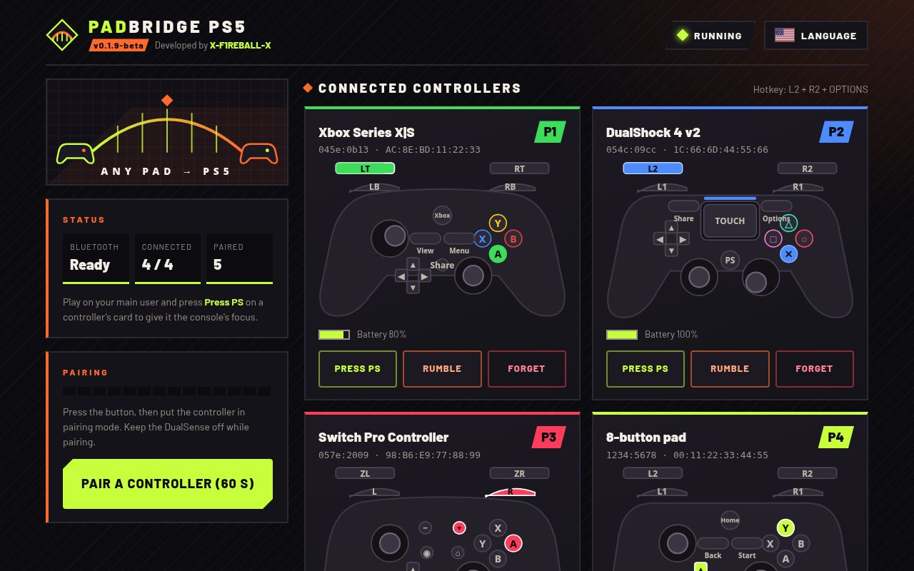

<p align="center"></p>

# PadBridge PS5

<p align="center"><b>PadBridge PS5</b> &middot; Developed by <a href="https://github.com/X-F1REBALL-X">X-F1REBALL-X</a></p>
<p align="center"><sub>Based on <a href="https://github.com/gmh5225/AnyPad-PS5">AnyPad-PS5</a> by <b>sinfiltros</b> (GPL-3.0)</sub></p>

<p align="center"></p>

**Use Xbox, DualShock 4, Switch Pro, 8BitDo and other Bluetooth controllers on a jailbroken PS5. No dongle needed.**

PadBridge PS5 is a payload (ELF) that runs in the background on a jailbroken PS5. It pairs Bluetooth
controllers through the console's own Bluetooth chip and presents each one to the system and to games
as a **virtual DualSense**. You can connect **up to four controllers at once**; they all work
simultaneously. It does not modify games, the firmware or the jailbreak, and everything is controlled
from a web page served by the console itself.

## Controllers

| Status | Controller |
|---|---|
| ✅ Tested on a real PS5 | **Xbox Series X\|S over Bluetooth LE** (`045e:0b13`, PS5 firmware 10.20) |
| ✅ Tested on a real PS5 | **DualShock 4 v2** (`054c:09cc`, PS5 firmware 10.20) |
| ✅ Tested on a real PS5 | **DualShock 4 v1** (`054c:05c4`, PS5 firmware 10.20) |
| 🧪 Supported, not tested on a console yet | Other Xbox One / Elite / Adaptive models (Classic and LE), DualSense, Switch Pro and Switch Online pads, 8BitDo, GameSir and others, plus a generic profile for any Bluetooth HID gamepad (adjustable with a `.map` file) |

The full list with every controller ID is in [COMPATIBILITY.md](COMPATIBILITY.md). Website: <https://x-f1reball-x.github.io/PadBridge-PS5/>

## Requirements

- A jailbroken PS5 with an ELF loader listening on port **9021** (elfldr), or Payload Manager.
- A PC or phone on the same network to open the web page (it also opens from the console's media row).
- Up to **four** bridged controllers at once (all work simultaneously).

## Before you start

- If the search ever pairs the DualSense by mistake, reset it (the small hole on the back, about 5 seconds)
  and reconnect it with a USB cable.

## Load it

Send `PadBridge-PS5-0.1.9-beta.elf` to the ELF loader, for example:

```
nc -q0 <ps5-ip> 9021 < PadBridge-PS5-0.1.9-beta.elf
```

or load it through Payload Manager. The console shows a notification with the menu address
(`http://<ps5-ip>:8095/`), and a **PadBridge** entry appears in the media row (the home icon).

## Pair a controller (first time)

1. After the ELF is loaded, open the **PadBridge** home icon in the media row (or open
   **`http://<ps5-ip>:8095/`** from a PC or phone).
2. Press **Pair a controller (60 s)** on that page. Do **not** use the PS5's own Bluetooth search in
   Settings: the console cannot pair these controllers by itself.
3. Put the controller in pairing mode so it **blinks fast**:
   - **Xbox**: turn it on, then hold the small pair button on top until the Xbox logo **blinks fast**
     (a slow blink means it is only trying to reconnect).
   - **DualShock 4**: hold Share + PS until the light bar flashes.
   - **Switch Pro**: hold the sync button next to the USB-C port.
4. When PadBridge detects the controller, **turn that controller off, then turn it on again**. This power
   cycle is required the first time so it starts working with the stored keys. The console shows a
   notification with the full model name, e.g. `PadBridge: Xbox Series X|S connected (slot 1)`.

After that first power cycle, you do **not** need to pair again. Pairing is saved on the console
(`/data/padbridge/pads.db`). After a console reboot or a new run of PadBridge, just turn the controller on
and it reconnects by itself.

**After pairing succeeds**, turn the DualSense off to play with the bridged controller. PadBridge does not
power the DualSense down: on the DualSense, **hold the PS button** until it powers down.

Repeat pairing for each extra pad. **Up to four** bridged controllers can stay connected and work at the
same time (slots 1–4).

## Using an Xbox controller

| Xbox | PS5 |
|---|---|
| A / B / X / Y | Cross / Circle / Square / Triangle |
| Menu (≡) | **Options** |
| View (⧉) | Touchpad click |
| Share | Create |
| Xbox button | PS |

**Press PS.** Controllers without a PS button can still take the console's focus: press **Press PS** on the
controller's card on the web page. It acts like holding PS on the controller; the console shows a system
message and gives control to that controller. Press it again whenever the DualSense takes priority back.

**Rumble test.** Press **Rumble** on the controller's card. The controller rumbles for 500 ms, then stops.
Rumble sent by **games** is not passed to the controller yet (see [Known limits](#known-limits)).

## Language

The web page has a **Language** button (top right) with eleven languages: English, العربية (Arabic, right to
left), עברית (Hebrew, right to left), Español, Français, Deutsch, Português, Русский, 日本語, 中文 and Italiano.
English is the default.

The choice is saved on the console (`/data/padbridge/language`), so every browser that opens the page gets
it, and the console notifications (controller connected / disconnected, Bluetooth ready, pairing, stopped)
follow it too, always with the controller's full model name. The browser also keeps it in `localStorage`
for the first moment before the console answers.

## Stopping and updating

- Closing the page leaves PadBridge running.
- To stop it, press **Stop PadBridge (advanced)** at the bottom of the page twice. Controllers disconnect
  and Bluetooth is left as it was. Always stop it before loading a new ELF.
- PadBridge stops by itself before the console goes into rest mode; load it again after waking.

## Files on the console

Everything lives in `/data/padbridge/`:

| File | What it is |
|---|---|
| `padbridge.log` | The log (also shown on the page under **Log**) |
| `pads.db` | Paired controllers and their keys |
| `language` | The language chosen on the page |
| `config.ini` | Optional settings |
| `maps/VVVV_PPPP.map` | Optional button maps for the generic profile (see `maps/EXAMPLE.map`) |
| `pair`, `stop` | Create one of these empty files to start pairing or to stop PadBridge |
| `no_icon`, `remove_icon` | Do not add the media-row entry / remove it once |

## Web API

The page uses a small HTTP API on port 8095, which you can also call from a PC on the same network. Every
`POST` must carry the header **`X-PadBridge: 1`** (requests without it are refused, so another website cannot
trigger actions); the `Host` must be an IP address or `localhost`.

| Method | Path | What it does |
|---|---|---|
| GET | `/api/state` | Version, Bluetooth state, language, connected and paired controllers (JSON) |
| GET | `/api/log` | The end of the log (text) |
| POST | `/api/pair` | Pair for 60 seconds |
| POST | `/api/ps?slot=N` | Press PS on the controller in slot N (1-4) |
| POST | `/api/rumble?slot=N` | 500 ms rumble test on slot N |
| POST | `/api/forget?addr=AA:BB:CC:DD:EE:FF` | Forget a paired controller |
| POST | `/api/lang?code=xx` | Set the language: `en`, `ar`, `he`, `es`, `fr`, `de`, `pt`, `ru`, `ja`, `zh`, `it` |
| POST | `/api/retry` | Try Bluetooth again after a failure |
| POST | `/api/stop` | Stop PadBridge |

Example:

```
curl -X POST -H "X-PadBridge: 1" "http://<ps5-ip>:8095/api/rumble?slot=1"
```

## Known limits

- **Rumble from games is not passed to the controller yet.** There is no known way to read the rumble a game
  sends to a virtual DualSense, so only the 500 ms test makes the controller rumble.
- Controllers marked 🧪 are supported in the code and pass the simulator tests but have not been tried on a
  console yet. Reports are welcome (model, console firmware, what worked, and `padbridge.log`).
- Beta software: stop it from the page before loading it again.

## Building

```
make test                                            # host tests and simulators (Linux/macOS)
make ps5 PS5_PAYLOAD_SDK=/path/to/ps5-payload-sdk    # dist/PadBridge-PS5-<version>.elf
```

The web page (`web/index.html`) and the icon are embedded in the ELF; `make` regenerates
`src/web_page.c` and `src/icon_data.c` from them. The version is set in `src/version.h`.

## License and credits

GPL-3.0-or-later, see [LICENSE](LICENSE). Third-party credits are in [NOTICE](NOTICE).
